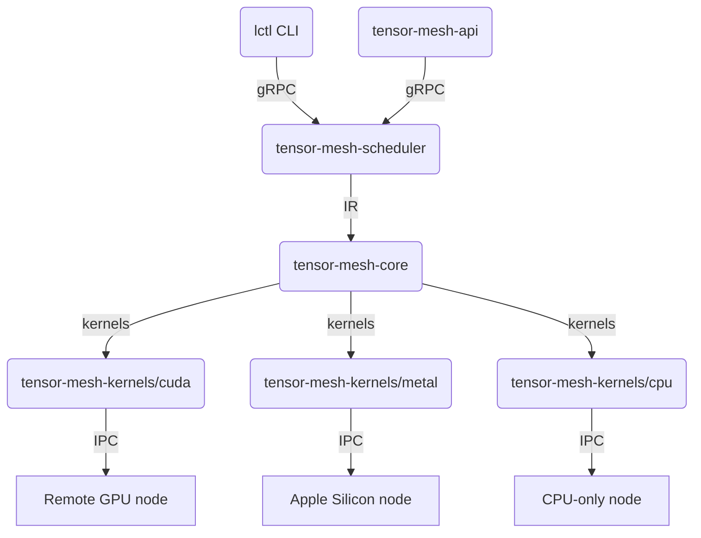

<!-- README.md -->
# TensorMesh

> **Universal, distributed, zero-copy inference engine for every transformer.**

| ⚡️ | **Status**        | MVP 0.1.0 in progress |
|----|-------------------|-----------------------|
| 🦀 | **Language**      | 100 % Safe Rust       |
| 🚀 | **Performance**   | 2× Hugging Face TGI on 4× RTX 4090 (early) |
| 🔗 | **Target**        | macOS, Linux, Windows, CUDA, Metal, WebGPU |

---

## What it does

1. Load **any** Hugging-Face, GGUF, or custom transformer checkpoint.
2. Split the compute graph across **heterogeneous devices** (Apple M-series, NVIDIA, AMD, Intel, CPU-only).
3. Migrate individual layers **sub-second** when nodes join or leave the cluster.
4. Serve an **OpenAI-compatible HTTP+WebSocket API**—drop-in replacement for existing clients.
5. Hot-swap LoRA adapters without restart; share KV-cache shards via zero-copy IPC.

---

## Architecture (where we’re heading)



# Repository Layout (will appear as we land crates)

```
tensor-mesh/
├── Cargo.toml                    # workspace root
├── README.md                     # ← you are here
├── crates/
│   ├── tensor-mesh-core/         # device-agnostic IR, Tensor, Graph
│   ├── tensor-mesh-hip2/         # zero-copy shared-memory & qRPC transport
│   ├── tensor-mesh-kernels/      # CUDA / Metal / CPU kernel plugins
│   ├── tensor-mesh-scheduler/    # data-flow scheduler + memory planner
│   ├── tensor-mesh-model/        # safetensors / GGUF loader & tokenizer
│   ├── tensor-mesh-api/          # axum-based OpenAI-compatible server
│   └── lctl/                     # CLI binary
├── benches/                      # criterion micro-benches
├── tests/                        # integration & e2e
└── docs/                         
    ├── arch.md
    └── perf.md
```

## Quick start (once crates land)

```bash
# Build everything
cargo build --release --all-features

# Single-node server
./target/release/tensor-mesh-api

# Multi-node cluster
lctl cluster join --addr 192.168.1.12:1337
lctl model load /models/llama-3-70b-q4_k_m.gguf
```

## Road-map (Milestones)

| Milestone | Description                      | ETA |
|-----------|----------------------------------|-----|
| 0.1.0 MVP | Single-node, single-GPU, OpenAI API | ... |
| 0.2.0     | Cluster support, layer migration | ... |
| 0.3.0     | LoRA hot-swap, KV-cache sharing  | ... |
| 0.4.0     | WebGPU runner, browser edge node | ... |

## Contributing

1. Open an issue for any crate you want to hack.

2. Run `cargo xtask ready` before PR (lint, test, bench).

3. Weekly dev-logs posted in GitHub Discussions.

## License

MIT or Apache-2.0 — you choose.